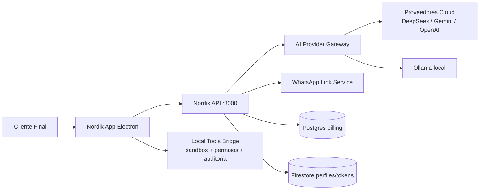

# Nordik-IA

[](LICENSE)
[](https://www.python.org/)
[](https://react.dev/)
[](https://fastapi.tiangolo.com/)

**Asistente IA de escritorio para Windows** — un agente que vive en tu PC, chatea con modelos de IA en la nube, ejecuta herramientas locales con permisos explícitos y se controla desde WhatsApp. Diseñado para personas no técnicas: **sin terminal, sin configuración técnica**.

---

## Qué hace

| Capacidad | Descripción |
|-----------|-------------|
| 💬 **Chat IA** | Conversación con múltiples proveedores (DeepSeek, Gemini, OpenAI, Ollama local) con enrutamiento y fallback automático |
| 🛠️ **Herramientas locales** | Crear/editar Word, Excel, PDFs; búsqueda de archivos; descargas — todo con permisos explícitos y auditoría |
| 📱 **WhatsApp** | Vincula tu teléfono: controla el asistente desde WhatsApp, respuestas automáticas, voz |
| 🔑 **Pendrive físico** | Autenticación con cédula + clave + llave física USB (anti-piratería y anti-clonación) |
| 🗓️ **Google Workspace** | Gmail y Calendar vía OAuth con tokens cifrados |
| ⚡ **Automatizaciones** | Agente que planifica y ejecuta tareas multi-paso por sí solo |
| 🧠 **Memoria** | Embeddings locales (ONNX) para recordar hechos y contexto entre conversaciones |
| 🖼️ **Imagen y visión** | Generación de imágenes (Vertex Imagen / DALL-E) y análisis de imágenes |
| 🔍 **Búsqueda web** | Grounding con fuentes verificadas y control de alucinaciones |

---

## Arquitectura



**Principios de diseño:**

1. **Modularidad por dominio** — auth, suscripción, chat, tools, WhatsApp, billing como módulos independientes.
2. **Puertos y adaptadores** — proveedor IA, filesystem, Office, WhatsApp y repositorios son intercambiables.
3. **Contratos estables** — DTOs versionados entre backend y Electron para evolucionar sin romper el cliente.
4. **Seguridad por defecto** — permisos explícitos para tools locales, auditoría, rate-limiting, tokens cifrados con Fernet, JWT con rotación.
5. **Sin terminal para el cliente** — toda configuración crítica tiene interfaz guiada.
6. **Feature flags** — capacidades activadas por etapas.

---

## Stack

| Capa | Tecnología |
|------|-----------|
| Frontend desktop | React 19, Vite, Electron, Framer Motion, Zustand, Baileys |
| Backend | Python 3.11+, FastAPI, SQLAlchemy, PyJWT, Firebase Admin, Vertex AI |
| Base de datos | PostgreSQL 16 (billing) + Firestore (perfiles/tokens) |
| Paquete compartido | `packages/dot-billing` (modelos SQLAlchemy, hashing, utilidades) |
| Calidad | Ruff, mypy, pytest (cobertura >60%), vitest, ESLint, CodeQL |

---

## Arranque rápido con Docker

```bash
# 1. Clonar
git clone https://github.com/felixaroc-a/Nordik-IA.git
cd Nordik-IA

# 2. Configurar Postgres
cp infra/billing/.env.example infra/billing/.env

# 3. Levantar Postgres + API
docker compose up -d

# 4. Verificar
curl http://localhost:8000/health
```

El frontend corre en modo desarrollo:

```bash
cd apps/dot/frontend
npm install
npm run dev        # Vite web en http://localhost:5173
npm run desktop    # App Electron completa
```

### Configuración mínima

Copia `apps/dot/backend/.env.example` → `apps/dot/backend/.env` y define al menos:

| Variable | Obligatoria | Nota |
|----------|-------------|------|
| `DEEPSEEK_API_KEY` | Para chat IA | Plataforma DeepSeek |
| `JWT_SECRET` | Sí | Firma de tokens de sesión |
| `TOKEN_ENCRYPTION_KEY` | Para OAuth | `python -c "from cryptography.fernet import Fernet; print(Fernet.generate_key().decode())"` |
| `HARDWARE_TOKEN_PEPPER` | Para pendrive | Debe ser igual en todos los servicios |

---

## Arranque manual (Windows)

```powershell
# 1. Postgres (Docker o instalación nativa)
Copy-Item infra\billing\.env.example infra\billing\.env
cd infra\billing
docker compose --env-file .env up -d
cd ..\..

# 2. Paquete compartido
pip install -e packages/dot-billing

# 3. Backend
cd apps\dot\backend
Copy-Item .env.example .env
pip install -r requirements.txt
python -m uvicorn app.main:app --reload --host 127.0.0.1 --port 8000

# 4. Frontend
cd ..\frontend
npm install
npm run desktop
```

---

## Estructura del repositorio

```
Nordik-IA/
├── apps/
│   └── dot/
│       ├── backend/        # FastAPI: auth JWT, chat IA, tools, WhatsApp, OAuth
│       │   ├── app/        #   routers, services, repositorios (hexagonal)
│       │   ├── worker/     #   worker de tareas en segundo plano
│       │   └── alembic/    #   migraciones de base de datos
│       └── frontend/       # React 19 + Electron + Vite
│           ├── src/        #   features, hooks, componentes
│           └── electron/   #   proceso principal, bridges, USB detection
├── packages/
│   └── dot-billing/        # Paquete compartido (SQLAlchemy, hashing)
├── infra/
│   ├── billing/            # Postgres + schema
│   ├── cloud-run/          # Deploy GCP
│   ├── nginx/              # Reverse proxy / TLS
│   └── observability/      # Prometheus + Grafana
├── docs/                   # Arquitectura, contratos, guías
└── docker-compose.yml      # Stack completo local
```

---

## Testing y CI

El repositorio tiene **CI completo** en GitHub Actions:

- **Lint**: Ruff (Python) + ESLint (TypeScript)
- **Typecheck**: mypy (Python) + tsc (TypeScript)
- **Tests**: pytest backend + vitest frontend con cobertura mínima del 60%
- **Seguridad**: CodeQL SAST + `pip-audit` + `npm audit`
- **Contratos**: regeneración de tipos OpenAPI verificada contra diff

```bash
# Backend
cd apps/dot/backend
python -m pytest app/tests/ --cov=app

# Frontend
cd apps/dot/frontend
npm test
npm run lint
```

---

## Seguridad

- Autenticación por **cédula + clave + pendrive USB** (hash con pepper)
- **JWT con rotación** (access + refresh), sesiones revocables
- Tokens OAuth y mensajes de chat **cifrados con Fernet** en reposo
- **Rate-limiting** y auditoría de operaciones sensibles
- Sandbox de ejecución de tools locales con permisos explícitos
- Ver [`docs/SECURITY.md`](docs/SECURITY.md) y [`docs/THREAT_MODEL.md`](docs/THREAT_MODEL.md) para el modelo de amenazas

---

## Contribuir

Las contribuciones son bienvenidas. Revisa [`docs/DEVELOPER-GUIDE.md`](docs/DEVELOPER-GUIDE.md) y [`docs/CONTRACTS`](docs/contracts-v1.md) antes de modificar endpoints. **Nunca incluyas secretos en tus commits.**

---

## Licencia

MIT — ver [`LICENSE`](LICENSE).
